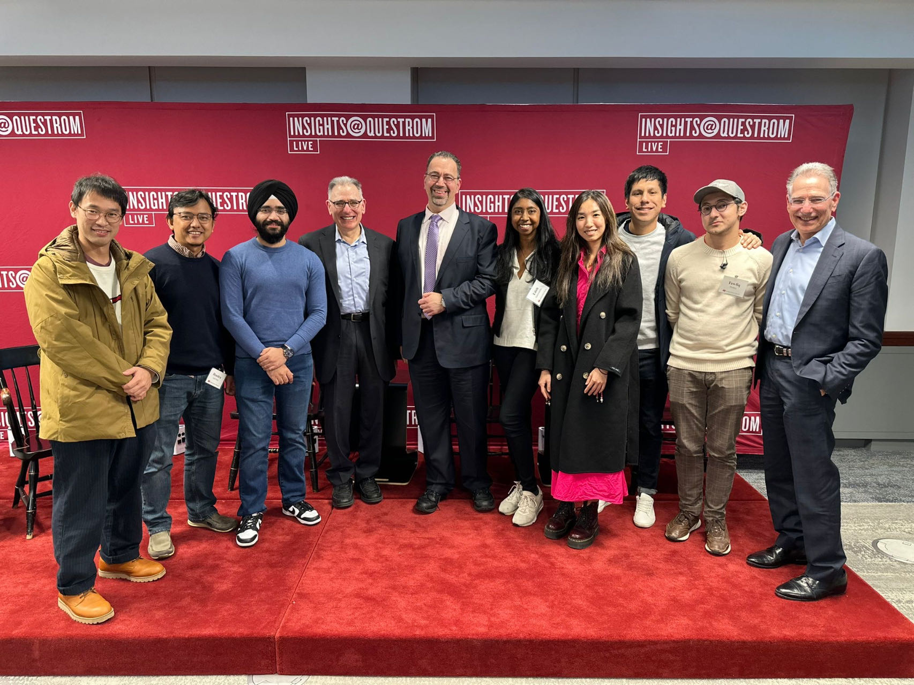

You can <a href="assets/pdf/rosa_cv_general.pdf" download>download My CV/Resume here</a>.

Summary
--
- Education: Master's in Global Development Economics (In progress), Bachelor's in Economics with a Minor in Mathematics.
- Skills: Proficient in data analysis using STATA, R, and Excel; strong qualitative and quantitative research abilities; excellent written and verbal communication in English and Mandarin.
- Experience: Research Assistant at Boston University, Graduate Economics Association Representative, Volunteer Teacher in Qinghai, China.

